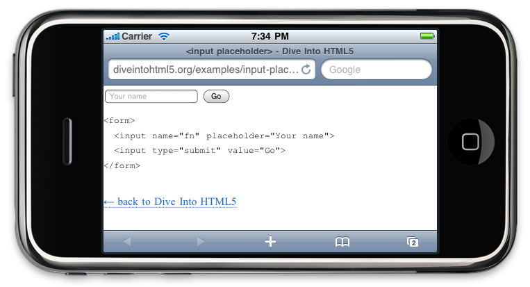
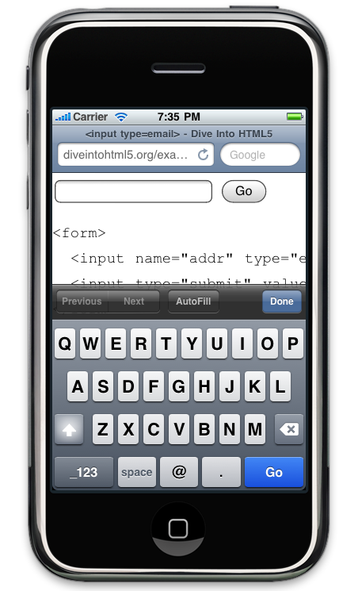
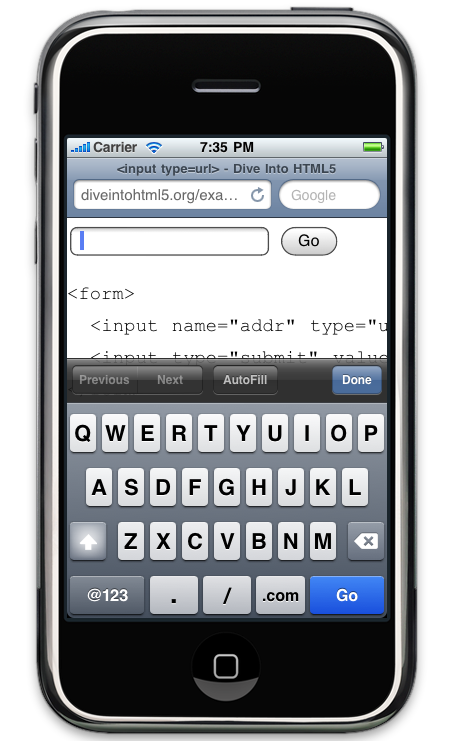
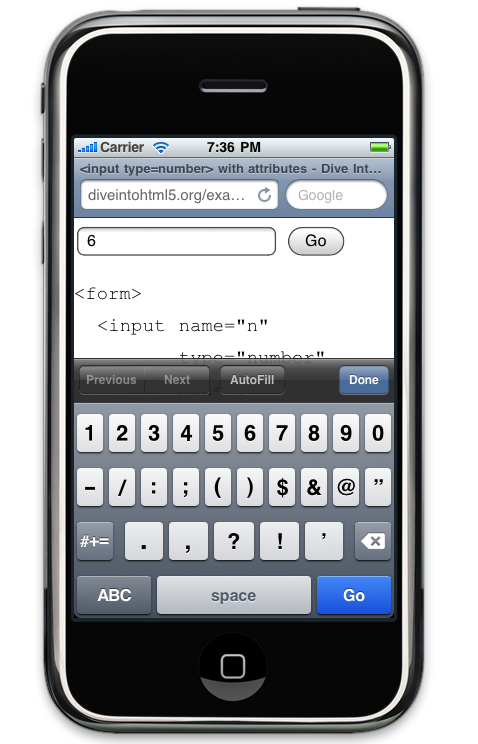
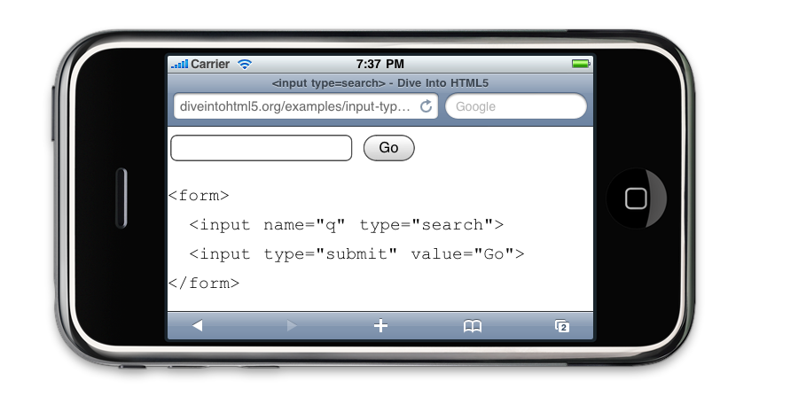

!SLIDE

# Elements & Attributes #

!SLIDE

	@@@ html
	<link rel="archives" …>
	<link rel="author" …>
	<link rel="external" …>
	<link rel="noreferer" …>
	<link rel="pingback" …>
	<link rel="prefetch" …>

!SLIDE

	@@@html
	<section>
	<nav>

!SLIDE

	@@@ html
	<nav>
	  <ul>
	    <li><a href="#">home</a></li>
	    <li><a href="#">blog</a></li>
	    <li><a href="#">gallery</a></li>
	    <li><a href="#">about</a></li>
	  </ul>
	</nav>

!SLIDE

	@@@ html
	<article>
	<header>
	<footer>

!SLIDE

	@@@ html
	<article>
	  <header>
	    <h1>A syndicated post</h1>
	  </header>
	  
Lorem ipsum blah blah…

	</article>
	<footer>
	  &copy; 2010, me
	</footer>

!SLIDE

	@@@html
	<aside>
	<mark>

!SLIDE

	@@@html
	<time>
	<time datetime="2009-10-22" pubdate>October 22, 2009</time>

!SLIDE

# Forms #

!SLIDE

	@@@ html
	<input name="q" placeholder="Search me!">

!SLIDE center

!SLIDE

	@@@ html
	<input name="q" autofocus>

!SLIDE

	@@@ html
	<input type="email">

!SLIDE center

!SLIDE

	@@@ html
	<input type="url">

!SLIDE center

!SLIDE

	@@@ html
	<input type="number"
	       min="0"
	       max="10"
	       step="2"
	       value="6">

!SLIDE center

!SLIDE

	@@@ html
	<input type="range"
	       min="0"
	       max="10"
	       step="2"
	       value="6">

!SLIDE

	@@@ html
	<input type="date">
	<input type="month">
	<input type="week">
	<input type="time">
	<input type="datetime">
	<input type="datetime-local">

!SLIDE

	@@@ html
	<form>
	  <input name="q" type="search">
	  <input type="submit" value="Find">
	</form>

!SLIDE center

!SLIDE

	@@@ html
	<input type="color">
